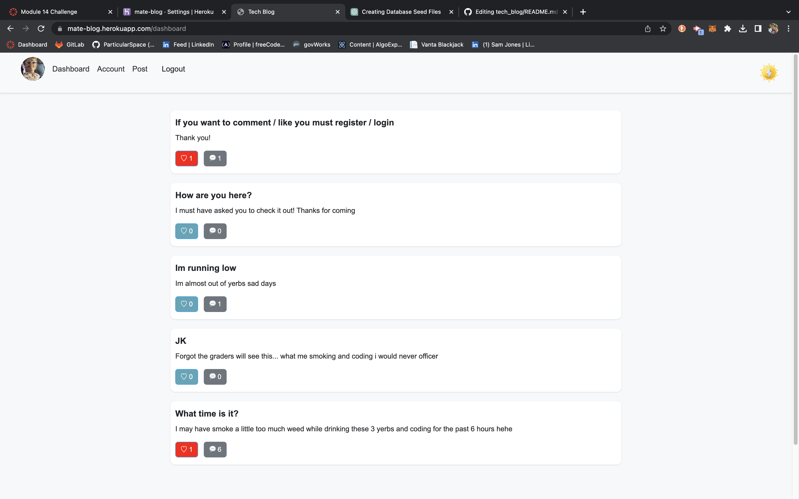

# tech_blog

  
  
  ## URL
  
    https://mate-blog.herokuapp.com/

  ## Description

  Mate Blog is a place for developers, nerds, granola boys, punk rocksters, and everything around and inbetweent o post and chat about tech.

  ## Table of Contents

  - [Installation](#installation)
  - [Usage](#usage)
  - [Images](#images)
  - [Credits](#credits)
  - [License](#license)
  - [Tests](#tests)
  - [Questions](#questions)

  ## Installation

  N/A

  ## Usage

  After registering and logging in, the user will be able to post, like, and comment!
  
  ## Images
  
  
  
  ## License

 This project is licensed under the MIT license. To learn more please visit https://choosealicense.com/licenses/mit/

  ## Credits

  Sam Jones,
  Stack Overflow (aws s3 issues),
  chatGPT (faker seed help, css boilerplate)
  Manny, (Class notes)

  ## Tests

  N/A

  ## Questions

  If you have any questions about the repo, open an issue or contact me directly at [samejones2018@gmail.com](mailto:samejones2018@gmail.com). You can find more of my work at [ParticularSpace](https://github.com/ParticularSpace).

